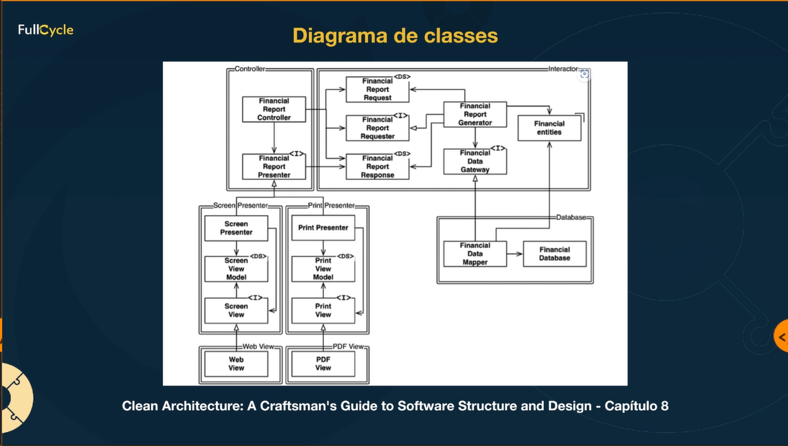

# MBA Fullcycle - Clean Architecture

A Clean Architecture é um conjunto de princípios e práticas de design de software que busca criar sistemas modularizados, independentes e de fácil manutenção. Proposta por Robert C. Martin, a Clean Architecture visa separar as preocupações do negócio das implementações técnicas, organizando o código em camadas concêntricas.

## Camadas
As camadas, como Entidades, Casos de Uso, Interfaces de Usuário e Frameworks Externos, são estruturadas hierarquicamente, com a direção de dependência apontando sempre para o centro, onde residem as entidades de domínio. Essa abordagem facilita a adaptação a mudanças nos requisitos de negócio, promove a testabilidade e possibilita a substituição de componentes sem afetar a lógica central do sistema.

## Flow of Controle
Na arquitetura limpa, o controle de fluxo é estruturado de maneira que as camadas mais internas, como as Entidades e os Casos de Uso, detêm o controle, enquanto as camadas mais externas, como as Interfaces de Usuário e os Frameworks Externos, dependem dessas camadas centrais

## Principais termos
- Entities: Entidades de domínio (Regras de negócio)
- Use Case Interactors: Defini o Input e o Output e como esse processo ocorre (Regras de aplicação)
- Interface Adapters, Gateways e Presenters: Portas de entrada e saída da aplicação, mas não devem ter acoplamento com a layer acima
- Frameworks e Drivers: Acomplamento com o mundo externo

## Principais conceitos
- Data Mappers: Entidade implementadora de Gatway, envolvendo conceitos de dependências
- Humble Object Pattern: Padrão para implementar testes em dependências difícies
- Screaming Architecture: A arquitetura de plantes grita sobre os cômodos, a arquitetura de software deve fazer o mesmo
- The Dependency Rule: Acoplamento deve vir sempre da camada de fora para dentro, nunca o contrário (Inversão de Dependência)
- Application Business Rules: Regras de aplicação
- Enterprise Business Rules: Regras de negócio

